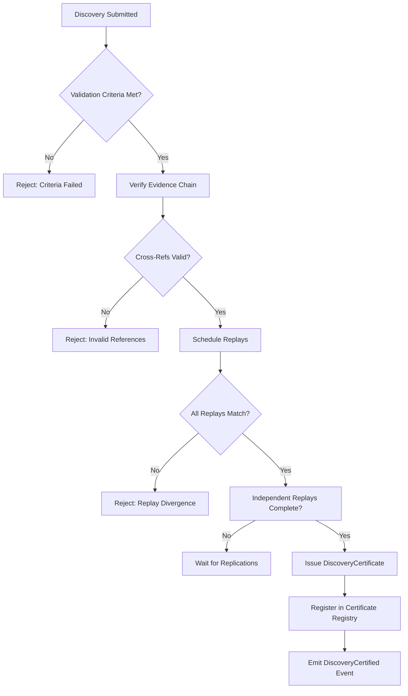
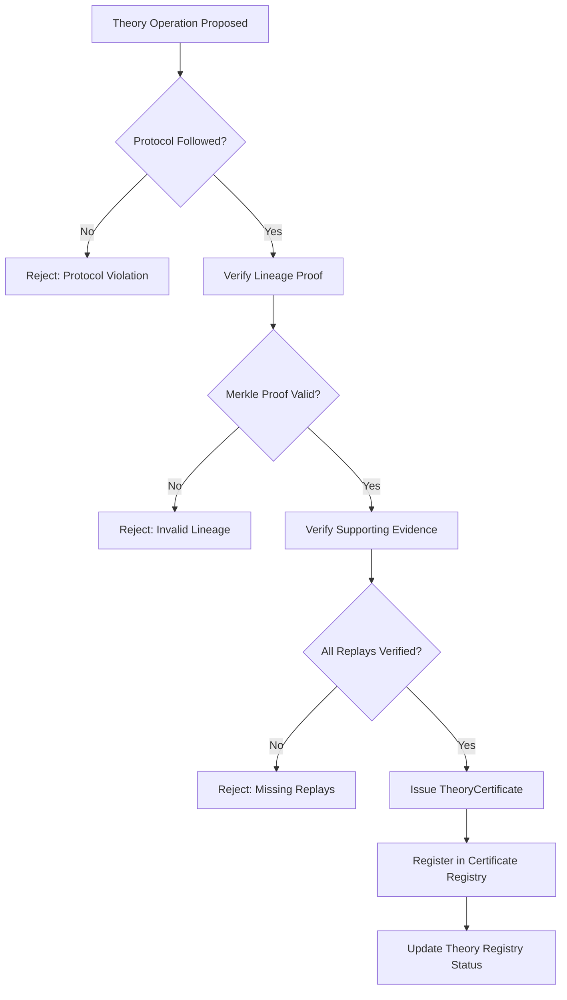

# Discovery Certification Framework

## Overview

This document specifies the complete certification framework for Phase 15 Scientific Discovery. Certification is the constitutional mechanism that transforms validated scientific claims into trusted knowledge. Every discovery, theory evolution, replay verification, and capital computation must be certified.

**Certification Principle**: No scientific claim enters the knowledge graph without a valid certificate. No certificate is valid without reproducible evidence.

---

## Certificate Types

### 1. DiscoveryCertificate
**Purpose**: Attests that a hypothesis has been tested, evidence collected, statistics significant, and independent replication achieved.

**Schema** (from DISCOVERY_DATA_MODEL.md):
```json
{
  "certificate_id": "blake3_hash",
  "certificate_type": "DISCOVERY",
  "schema_version": "15.0.0",
  "discovery_id": "blake3_hash",
  "hypothesis_hash": "blake3_hash",
  "evidence_hashes": ["blake3_hash"],
  "statistical_result_hash": "blake3_hash",
  "replication_proof_hashes": ["blake3_hash"],
  "validation_criteria": {},
  "validation_outcome": {},
  "issuer_id": "civilization_id",
  "issuer_signature": "ed25519_signature",
  "timestamp": "ISO8601",
  "validity_conditions": {}
}
```

**Issuance Criteria**:
- Hypothesis state = SUPPORTED or FALSIFIED (with evidence)
- Statistical significance: p < 0.05 OR Bayes Factor > 10
- Effect size ≥ minimum threshold (domain-specific)
- ≥2 independent replications by different civilizations
- Replication consistency: effect direction matches
- Robustness checks pass (sensitivity, outlier, assumption)
- No falsifying evidence unaddressed
- Replay verification: Level 1 (hash equality) for all supporting executions

---

### 2. ReplayCertificate
**Purpose**: Attests that deterministic replay of an execution produced identical results.

**Schema** (from DISCOVERY_DATA_MODEL.md):
```json
{
  "certificate_id": "blake3_hash",
  "certificate_type": "REPLAY",
  "schema_version": "15.0.0",
  "original_hash": "blake3_hash",
  "replay_hash": "blake3_hash",
  "environment_snapshot_hash": "blake3_hash",
  "executor_id": "civilization_id",
  "verifier_id": "civilization_id",
  "verification_level": "LEVEL1|LEVEL2|LEVEL3",
  "match": true,
  "divergence_report": null,
  "verifier_signature": "ed25519_signature",
  "timestamp": "ISO8601"
}
```

**Issuance Criteria**:
- Replay executed with identical environment snapshot
- Verification level matches requirement:
  - LEVEL1 (hash equality): Discovery certification, Theory operations
  - LEVEL2 (semantic equality): Statistical re-analysis
  - LEVEL3 (structural equality): Pipeline stage replay
- Independent verifier (different civilization from original executor)
- Divergence report included if match = false
- Certificate issued within 24 hours of replay completion

---

### 3. TheoryCertificate
**Purpose**: Attests that a theory evolution operation followed constitutional protocol.

**Schema** (from DISCOVERY_DATA_MODEL.md):
```json
{
  "certificate_id": "blake3_hash",
  "certificate_type": "THEORY",
  "schema_version": "15.0.0",
  "theory_id": "blake3_hash",
  "operation": "NEW|REVISE|SUPERSEDE|CONTRADICT|MERGE|DEPRECATE",
  "previous_theory_hash": "blake3_hash|null",
  "justification_hash": "blake3_hash",
  "supporting_discovery_hashes": ["blake3_hash"],
  "contradicting_evidence_hashes": ["blake3_hash"],
  "replay_certificate_hashes": ["blake3_hash"],
  "lineage_proof": "merkle_proof",
  "issuer_id": "civilization_id",
  "issuer_signature": "ed25519_signature",
  "timestamp": "ISO8601",
  "validity_conditions": {}
}
```

**Issuance Criteria by Operation**:
| Operation | Requirements |
|-----------|-------------|
| NEW | Formal statement, scope, axioms, ≥1 supporting discovery |
| REVISE | Previous theory ACTIVE, modification preserves core, justification |
| SUPERSEDE | New theory explains all old theory phenomena + more, replay of key experiments |
| CONTRADICT | Evidence contradicts theory, replay verified, theory status → CONTRADICTED |
| MERGE | Two theories compatible, unified theory subsumes both, all discoveries replayed |
| DEPRECATE | No active discoveries, no predictions pending, community consensus |

---

### 4. CapitalCertificate
**Purpose**: Attests that a scientific capital delta was computed correctly from validated sources.

**Schema** (from DISCOVERY_DATA_MODEL.md):
```json
{
  "certificate_id": "blake3_hash",
  "certificate_type": "CAPITAL",
  "schema_version": "15.0.0",
  "capital_type": "DISCOVERY|EVIDENCE|KNOWLEDGE|THEORY|PREDICTION|ENGINEERING|INNOVATION|REPRODUCIBILITY",
  "delta_hash": "blake3_hash",
  "source_hashes": ["blake3_hash"],
  "computation_proof": "blake3_hash",
  "confidence": 0.95,
  "reproducibility_multiplier": 1.5,
  "issuer_id": "protocol",
  "issuer_signature": "ed25519_signature",
  "timestamp": "ISO8601"
}
```

**Issuance Criteria**:
- All source objects have valid certificates
- Computation follows frozen formula: ΔCapital = Σ(weight_i × Δmetric_i) × confidence × reproducibility_multiplier
- Deterministic computation verified by replay
- Capital type weights from pipeline configuration
- Reproducibility multiplier ≥ 1.0 (based on independent replication count)

---

### 5. AuditCertificate
**Purpose**: Attests that an independent audit of scientific claims has been completed.

**Schema**:
```json
{
  "certificate_id": "blake3_hash",
  "certificate_type": "AUDIT",
  "schema_version": "15.0.0",
  "audit_id": "blake3_hash",
  "scope": "DISCOVERY|THEORY|KNOWLEDGE_GRAPH|CAPITAL|FULL_SYSTEM",
  "subject_hashes": ["blake3_hash"],
  "auditor_id": "civilization_id",
  "audit_methodology": "string",
  "findings": [
    {"type": "COMPLIANT|NON_COMPLIANT|ANOMALY", "description": "string", "evidence": "blake3_hash"}
  ],
  "overall_result": "PASS|CONDITIONAL_PASS|FAIL",
  "issuer_signature": "ed25519_signature",
  "timestamp": "ISO8601"
}
```

---

## Certificate Registry

### Structure
The Certificate Registry is a content-addressed, append-only ledger with Merkle proofs.

**Entry Format**:
```json
{
  "entry_id": "blake3_hash",
  "certificate": { ... certificate object ... },
  "registered_at": "ISO8601",
  "registrar_id": "civilization_id",
  "merkle_proof": { "root": "hash", "path": ["hash"], "index": 42 },
  "status": "ACTIVE|REVOKED|SUPERSEDED"
}
```

### Indexes
1. **Primary**: certificate_id → entry (unique)
2. **Type**: certificate_type → [entry_id]
3. **Subject**: subject_hash (discovery_id/theory_id/etc) → [entry_id]
4. **Issuer**: issuer_id → [entry_id]
5. **Time**: registered_at → [entry_id] (B-tree)
6.+ tree)
6. **Status**: status → [entry_id]

---

## Certificate Issuer

### Role
The Certificate Issuer is a protocol-owned service that issues certificates upon verification of criteria. It does not make scientific judgments—it verifies that criteria are met.

### Selection
- **Protocol Governance**: Constitutional Council appoints issuer nodes
- **Rotation**: Issuer keys rotated every epoch (90 days)
- **Reputation**: Issuer nodes earn Reproducibility Capital for correct issuance
- **Audit**: All issuer decisions subject to independent audit

### Issuance Process
```
1. Request received with subject data
2. Verify all criteria for certificate type
3. Verify cross-references (subjects exist, certificates valid)
4. Compute certificate content hash (Blake3)
5. Sign with issuer Ed25519 key
6. Register in Certificate Registry with Merkle proof
7. Emit CertificateIssued event
8. Return certificate to requestor
```

### Verification API
```elixir
@spec verify(certificate_id) :: {:ok, verification_result} | {:error, reason}
@spec verify_chain(certificate_id) :: {:ok, chain_proof} | {:error, reason}
@spec verify_issuer(certificate_id) :: {:ok, issuer_proof} | {:error, reason}
@spec get_certificate(certificate_id) :: {:ok, certificate} | {:error, :not_found}
```

**Verification Result**:
```json
{
  "certificate_id": "blake3_hash",
  "valid": true,
  "signature_valid": true,
  "registry_proof": "merkle_proof",
  "issuer_authorized": true,
  "criteria_met": true,
  "subjects_exist": true,
  "cross_references_valid": true,
  "replay_verified": true,
  "timestamp": "ISO8601"
}
```

---

## Automated Certification Pipeline

### Discovery Certification Pipeline


### Theory Certification Pipeline


---

## Revocation Mechanism

### Grounds for Revocation
1. **Evidence Fraud**: Evidence found fabricated or manipulated
2. **Replay Failure**: Independent replay produces divergence
3. **Protocol Violation**: Certification issued without meeting criteria
4. **Theory Contradiction**: New evidence contradicts certified discovery
5. **Computational Error**: Capital delta computation error discovered
6. **Issuer Compromise**: Issuer key compromised

### Revocation Process
```
1. Revocation request submitted with evidence
2. Independent audit initiated (different civilization)
3. AuditCertificate issued with findings
4. If FAIL or CONDITIONAL_PASS with critical findings:
   a. Certificate status → REVOKED in registry
   b. RevocationCertificate issued
   c. Downstream certificates notified (cascade check)
   d. Capital deltas reversed (negative delta issued)
   e. Knowledge graph edges marked REVOKED
   f. Emit CertificateRevoked event
```

### RevocationCertificate Schema
```json
{
  "certificate_id": "blake3_hash",
  "certificate_type": "REVOCATION",
  "schema_version": "15.0.0",
  "revoked_certificate_id": "blake3_hash",
  "revocation_reason": "EVIDENCE_FRAUD|REPLAY_FAILURE|PROTOCOL_VIOLATION|THEORY_CONTRADICTION|COMPUTATIONAL_ERROR|ISSUER_COMPROMISE",
  "audit_certificate_id": "blake3_hash",
  "auditor_id": "civilization_id",
  "cascade_effects": [
    {"affected_certificate_id": "blake3_hash", "action": "REVOKE|REVIEW"}
  ],
  "issuer_signature": "ed25519_signature",
  "timestamp": "ISO8601"
}
```

---

## Certificate Chains

### Discovery Chain
```
Observation → Pattern → Hypothesis → Experiment → Evidence → StatisticalResult → Discovery → DiscoveryCertificate
```

### Theory Chain
```
DiscoveryCertificate(s) → TheoryCertificate (NEW) → TheoryCertificate (REVISE)* → TheoryCertificate (SUPERSEDE|CONTRADICT|...)
```

### Capital Chain
```
DiscoveryCertificate → CapitalCertificate (DISCOVERY)
Evidence → CapitalCertificate (EVIDENCE)
KnowledgeNode/Edge → CapitalCertificate (KNOWLEDGE)
TheoryCertificate → CapitalCertificate (THEORY)
Validated Prediction → CapitalCertificate (PREDICTION)
...
ReplayCertificate → CapitalCertificate (REPRODUCIBILITY)
```

---

## Constitutional Compliance

| Principle | Certification Implementation |
|-----------|------------------------------|
| **Reproducibility** | ReplayCertificate required for DiscoveryCertificate; independent verification mandatory |
| **Evidence-First** | All certificates reference evidence hashes; no certificate without evidence |
| **Content-Addressed** | All certificates identified by Blake3 hash of canonical serialization |
| **Archaeological** | Full certificate chain preserved; revocation creates audit trail |
| **Ownership** | Issuer_id, verifier_id, owner_id explicit in all certificates |
| **Lineage** | TheoryCertificate includes Merkle lineage proof; CapitalCertificate references sources |
| **Governance** | Issuer selection by Constitutional Council; revocation requires independent audit |

---

## Verification Matrix

| Certificate Type | Independent Verification | Replay Required | Audit Trigger |
|-----------------|-------------------------|-----------------|---------------|
| DiscoveryCertificate | ≥2 civilizations | Full replay (Level 1) | Automatic on issuance |
| ReplayCertificate | 1 verifier (≠ executor) | N/A (is replay) | On divergence |
| TheoryCertificate | 1 auditor | Key experiments replayed | On supersession/contradiction |
| CapitalCertificate | Protocol verification | All source replays | On computation error |
| AuditCertificate | N/A (is audit) | N/A | On dispute |

---

## Implementation Status

| Component | Status | Location |
|-----------|--------|----------|
| Certificate Schemas | ✅ Frozen | DISCOVERY_DATA_MODEL.md |
| Certificate Registry | ⏳ Planned | lib/tiannara/discovery/certificate_registry.ex |
| Certificate Issuer | ⏳ Planned | lib/tiannara/discovery/certificate_issuer.ex |
| Automated Pipeline | ⏳ Planned | lib/tiannara/discovery/certification_pipeline.ex |
| Revocation System | ⏳ Planned | lib/tiannara/discovery/revocation.ex |
| Verification API | ⏳ Planned | lib/tiannara/discovery/verification.ex |
| Integration Tests | ⏳ Planned | test/tiannara/discovery/certification_test.exs |

---

## Next Steps

1. Implement Certificate Registry with Merkle tree
2. Implement Certificate Issuer with Ed25519 signing
3. Build automated certification pipelines
4. Implement revocation cascade logic
5. Create verification API
6. Run certification integration tests
7. Produce CERTIFICATION_IMPLEMENTATION_REPORT.md

---

*This document is part of Phase 15.0 Architecture Review. No implementation occurs in this phase. Implementation begins in Stage 2.*