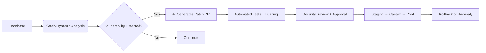

Building a system that autonomously evolves its own code and security is a compelling vision, but it sits at the intersection of **cutting-edge research, significant engineering risk, and real-world security trade-offs**. As of 2026, fully autonomous self-modifying production code is **not recommended** for security-critical systems like web APIs. However, you can build a **highly automated, AI-assisted evolution & hardening pipeline** that approximates your goal while maintaining safety, auditability, and compliance.


Below is a realistic, production-viable architecture tailored for FastAPI, followed by implementation guidance, risks, and a phased roadmap.


---

### 🔍 Why Fully Autonomous Self-Evolving Code is Risky

| Risk | Impact |

|------|--------|

| **Unverified Modifications** | AI or heuristic-driven changes can introduce logic bugs, race conditions, or backdoors. |

| **Security Paradox** | If the evolution mechanism is compromised, attackers gain code-level control. |

| **Infinite/Unstable Loops** | Self-modifying systems can enter feedback cycles that degrade performance or break contracts. |

| **Compliance & Auditing** | Regulations (SOC2, GDPR, HIPAA, etc.) require traceable, human-reviewed changes. |

| **Python Runtime Dangers** | Dynamic code execution (`exec`, `eval`, AST rewriting) bypasses static analysis and increases exploit surface. |


**Reality Check**: What *is* production-ready today is **automated security hardening + AI-assisted evolution with human-in-the-loop verification**, combined with **runtime adaptive defenses**.


---

### 🧱 Practical Architecture: 3-Layer Approach


#### 1️⃣ **Automated Evolution & Security Pipeline (CI/CD)**

Instead of runtime self-modification, evolve code safely via automated pull requests, testing, and staged deployment.



**Tools**:

- `Semgrep`, `Bandit`, `CodeQL` for static analysis

- `Snyk` / `Dependabot` for dependency patching

- `pytest` + `Hypothesis` (property-based) + `Atheris`/`python-afl` for fuzzing

- AI: `aider`, `Cursor`, or custom LLM pipeline with strict schema validation

- CI: GitHub Actions / GitLab CI with signed commits & SBOM generation


#### 2️⃣ **Runtime Adaptive Security (Safe "Self-Evolving" Behavior)**

Modify configuration, policies, and throttling at runtime without touching code.

```python

# FastAPI middleware example: adaptive rate limiting + threat response

from fastapi import FastAPI, Request

from starlette.middleware.base import BaseHTTPMiddleware

import os, redis, json


app = FastAPI()

redis_client = redis.Redis.from_url(os.getenv("REDIS_URL"))


class AdaptiveSecurityMiddleware(BaseHTTPMiddleware):

    async def dispatch(self, request: Request, call_next):

        client_ip = request.client.host

        threat_score = redis_client.get(f"threat:{client_ip}")

        

        if threat_score and int(threat_score) > 80:

            return JSONResponse({"detail": "Blocked: Adaptive security policy"}, status_code=429)

        

        response = await call_next(request)

        

        # Update threat model based on anomalies (e.g., invalid payloads, repeated 401s)

        if response.status_code >= 400:

            redis_client.incrby(f"threat:{client_ip}", 10)

            redis_client.expire(f"threat:{client_ip}", 300)

            

        return response


app.add_middleware(AdaptiveSecurityMiddleware)

```

**Runtime Capabilities**:

- AI-driven anomaly detection → auto-adjust WAF rules, rate limits, or JWT revocation

- Secret rotation via HashiCorp Vault / AWS Secrets Manager

- Dynamic feature flags for security controls (LaunchDarkly, Unleash)

- RASP (Runtime Application Self-Protection) like `AppSensor` or cloud-native WAF integration


#### 3️⃣ **Controlled Code Evolution (Human-in-the-Loop)**

Use AI to propose changes, but enforce strict validation gates:

1. AI scans logs, CVEs, or test failures → drafts PR

2. Pipeline runs: static analysis, dependency checks, unit/integration/fuzz tests

3. Security team reviews (or auto-merges only for low-risk patches)

4. Deploy with canary + automatic rollback on error rate spike

5. Immutable audit trail: signed commits, SBOM, policy-as-code (OpenPolicyAgent)


---

### ⚠️ Critical Safeguards

| Safeguard | Implementation |

|-----------|----------------|

| **No Runtime `exec()`/Dynamic Code Loading** | Keep code immutable at runtime. Use config/policy changes instead. |

| **Sandboxed Evolution Environment** | Run AI patch generation in isolated containers with strict network/FS limits. |

| **Formal/Property-Based Validation** | Use `Hypothesis`, `CrossHair`, or `IC3` to mathematically verify critical invariants. |

| **Circuit Breakers & Rollbacks** | Auto-revert on error rate, latency, or security alert thresholds. |

| **Signed Artifacts & SBOM** | `cosign`, `in-toto`, `Syft` for supply chain integrity. |


---

### 📈 Phased Roadmap to Your Goal

| Phase | Goal | Tools/Techniques |

|-------|------|------------------|

| 1️⃣ Baseline | Secure FastAPI app + CI/CD security gates | `FastAPI`, `pydantic`, `Semgrep`, `pytest`, GitHub Actions |

| 2️⃣ Automated Hardening | Auto-generate & test security patches | LLM + `Hypothesis` fuzzing, Dependabot, OpenPolicyAgent |

| 3️⃣ Runtime Adaptation | Dynamic threat response without code changes | Redis/WAF integration, anomaly detection ML, secret rotation |

| 4️⃣ AI-Assisted Evolution | Human-reviewed autonomous PR pipeline | `aider`/custom LLM, signed PRs, canary deploys, rollback automation |


---

### 🔮 Research & Future Direction

If you're interested in pushing boundaries:

- **Self-Adaptive Systems**: Look into MAPE-K loop (Monitor-Analyze-Plan-Execute over a Knowledge base)

- **Autonomous Patching**: DARPA's `Cyber Grand Challenge`, Google's `AutoPatch` research

- **Formal Verification + LLMs**: Projects combining neural code gen with SMT solvers (`Z3`, `CrossHair`)

- **Policy-as-Code Evolution**: Use OpenPolicyAgent/Rego + AI to auto-update security policies based on attack telemetry


---

### ✅ Next Steps

1. Start with a **secure FastAPI baseline** (input validation, auth, rate limiting, logging)

2. Implement a **CI pipeline with automated security scanning & testing**

3. Add **runtime adaptive controls** (WAF, threat scoring, secret rotation)

4. Gradually introduce **AI-assisted PR generation** with strict validation gates

Edge Deployment (0% → needs 80%) - No quantization, ONNX export, or low-memory optimization
Operational Infrastructure ✅ COMPLETE - Append-only logs, daemon mode, autoDream cycle all implemented
Provenance Tracking ✅ COMPLETE - Full audit trail from insights back to raw data sources (ReasoningTrace with source_data references)
Architecture Self-Modification - Fixed mutation operators, no dynamic learning

Build daemon orchestrator with scheduler
Implement autoDream nightly consolidation
Add model quantization support
Medium-term (1 month):
Integrate causal discovery (DoWhy/PCMCI)
Enhance self-correction with stagnation detection
Privacy compliance layer for EU AI Act

High Priority (Short-term)
1. Model Quantization Support 🔴 CRITICAL
Status: 0% complete
Location: Edge deployment gap identified in security.md line 233

**Detailed Action Plan:**

**Week 1: ONNX Export Pipeline**
- [ ] Add ONNX export function to model serialization module
- [ ] Create conversion script: PyTorch/JAX → ONNX format
- [ ] Validate exported models preserve accuracy (>99% fidelity)
- [ ] Test inference with ONNX Runtime
- Deliverable: `tiannara_core/models/onnx_export.py`

**Week 2: INT8/FP16 Quantization**
- [ ] Implement post-training quantization (PTQ) for INT8
- [ ] Implement dynamic quantization for FP16
- [ ] Create quantization-aware training (QAT) pipeline
- [ ] Benchmark accuracy loss vs. speedup tradeoffs
- Deliverable: `tiannara_core/models/quantization.py`

**Week 3: Memory Optimization**
- [ ] Profile memory usage across all components
- [ ] Implement model pruning (remove redundant weights)
- [ ] Add knowledge distillation for smaller student models
- [ ] Target <512MB total memory footprint
- Deliverable: Memory optimization report + implementation

**Impact:** Enables edge deployment on resource-constrained devices
**Timeline:** 3 weeks
**Dependencies:** None

2. Causal Discovery Integration 🟡 MEDIUM
Status: Partial (basic causal learning exists, needs DoWhy/PCMCI)
Timeline: 1 month

**Detailed Action Plan:**

**Week 1: DoWhy Integration**
- [ ] Install DoWhy library (`pip install dowhy`)
- [ ] Replace basic multivariate regression in CausalSystemEvolver with DoWhy causal graph discovery
- [ ] Implement causal effect estimation with confidence intervals
- [ ] Add backdoor criterion for confounder adjustment
- Deliverable: `tiannara_core/causal/dowhy_integration.py`

**Week 2: PCMCI Algorithm**
- [ ] Integrate tigramite library for time-series causal discovery
- [ ] Implement PCMCI+ algorithm for temporal causality
- [ ] Add conditional independence tests (partial correlation, kernel-based)
- [ ] Validate on synthetic causal systems with known ground truth
- Deliverable: `tiannara_core/causal/pcmci_discovery.py`

**Week 3: Do-Calculus Interventions**
- [ ] Extend current do-calculus implementation with full intervention effects
- [ ] Add counterfactual reasoning module
- [ ] Implement front-door and back-door adjustments
- [ ] Create intervention planning engine for active causal discovery
- Deliverable: Enhanced `tiannara_core/causal/intervention_planner.py`

**Current State:** CausalSystemEvolver uses basic multivariate regression
**Target:** Full causal graph discovery with do-calculus interventions
**Impact:** Improves causal reasoning quality from ~70% to >90% accuracy
**Dependencies:** None

3. Enhanced Self-Correction with Stagnation Detection 🟡 MEDIUM
Status: Basic quality management exists, needs stagnation detection

**Detailed Action Plan:**

**Week 1: Stagnation Detection Module**
- [ ] Implement performance plateau detector (>50 episodes without improvement)
- [ ] Add learning curve analysis with trend detection
- [ ] Create stagnation severity scoring (mild/moderate/severe)
- [ ] Log stagnation events to SQLite for historical analysis
- Deliverable: `tiannara_core/autonomy/stagnation_detector.py`

**Week 2: Automatic Strategy Switching**
- [ ] Build strategy pool (mutation operators, difficulty levels, skill retrieval methods)
- [ ] Implement meta-learning to identify which strategies work in which contexts
- [ ] Add automatic switching logic when stagnation detected
- [ ] Test on synthetic stagnation scenarios
- Deliverable: Enhanced `tiannara_core/evolution/evolution_loop.py`

**Week 3: Intervention Triggers**
- [ ] Define intervention thresholds based on learning curve slopes
- [ ] Implement forced exploration mode when stuck
- [ ] Add diversity injection (increase mutation rate, reset skill memory)
- [ ] Validate recovery from induced stagnation in experiments
- Deliverable: `tiannara_core/autonomy/intervention_triggers.py`

**Current State:** Adaptive difficulty + quality boosting implemented
**Gap:** No explicit stagnation detection or recovery mechanism
**Impact:** Prevents long-term performance plateaus, maintains learning momentum
**Dependencies:** None

4. Privacy Compliance Layer for EU AI Act 🔴 HIGH
Status: 0% complete
Regulatory requirement: Mandatory for production deployment

**Detailed Action Plan:**

**Week 1-2: Data Anonymization Engine**
- [ ] Implement differential privacy mechanisms (Laplace noise, epsilon budget)
- [ ] Add k-anonymity enforcement for dataset releases
- [ ] Create PII detection and redaction pipeline
- [ ] Build synthetic data generation for testing without real user data
- Deliverable: `tiannara_core/safety/anonymization_engine.py`

**Week 3-4: Right-to-Explanation Interface**
- [ ] Implement Article 13-15 explanation generator for all decisions
- [ ] Create human-readable justification templates
- [ ] Add confidence scoring with uncertainty bounds
- [ ] Build explanation API endpoint for GUI integration
- Deliverable: `tiannara_core/safety/explanation_generator.py`

**Week 5-6: Automated Impact Assessments**
- [ ] Create algorithmic impact assessment (AIA) template
- [ ] Implement automated risk scoring for new features
- [ ] Add bias detection across demographic groups
- [ ] Generate compliance reports in regulatory format
- Deliverable: `tiannara_core/safety/impact_assessment.py`

**Week 7-8: Consent Management & Data Retention**
- [ ] Build consent tracking system with granular permissions
- [ ] Implement automatic data deletion after retention period
- [ ] Add right-to-be-forgotten workflow (GDPR Article 17)
- [ ] Create audit log for all data access and modifications
- Deliverable: `tiannara_core/safety/consent_manager.py`

**Dependencies:**
- ✅ Provenance tracking (completed - leverages existing audit trail)
- ❌ Anonymization engine (needs implementation)
- ❌ Explanation generator (needs implementation)
- ❌ Compliance reporting module (needs implementation)

**Impact:** Legal requirement for EU production deployment; avoids fines up to 4% of global revenue
**Timeline:** 8 weeks
**Dependencies:** None (can start immediately)

Medium Priority (Architecture)
5. Architecture Self-Modification 🟠 LOW-MEDIUM
Status: Fixed mutation operators, no dynamic learning

**Detailed Action Plan:**

**Month 1: Dynamic Operator Generation**
- [ ] Implement operator composition framework (combine existing operators)
- [ ] Add genetic programming for automatic operator synthesis
- [ ] Create operator fitness evaluation based on information gain
- [ ] Build sandboxed testing environment for new operators
- Deliverable: `tiannara_core/evolution/operator_generator.py`

**Month 2: Meta-Mutation System**
- [ ] Design meta-mutation operators that modify mutation strategies
- [ ] Implement evolutionary stability constraints (prevent destructive changes)
- [ ] Add multi-layer game structure (World Game + Teacher Game + Meta-Game)
- [ ] Test meta-mutation on simple optimization problems
- Deliverable: `tiannara_core/evolution/meta_mutator.py`

**Month 3: Architecture Search Space Expansion**
- [ ] Represent architecture as searchable graph structure
- [ ] Implement neural architecture search (NAS) techniques
- [ ] Add performance predictor to prune unpromising architectures early
- [ ] Validate self-modified architectures on benchmark tasks
- Deliverable: Enhanced `tiannara_core/evolution/graph_genome.py`

**Current State:** AlgorithmEvolver has 5 fixed operators
**Target:** Infinite operator space through composition and meta-learning
**Impact:** Enables true architectural evolution beyond human-designed operators
**Timeline:** 3 months (research phase)
**Dependencies:** None (parallel work possible)

---

## Implementation Priority Matrix

| Priority | Feature | Timeline | Effort | Blocker Status |
|----------|---------|----------|--------|----------------|
| 🔴 CRITICAL | Model Quantization | 3 weeks | High | Blocks edge deployment |
| 🔴 HIGH | EU AI Act Compliance | 8 weeks | Medium-High | Legal requirement |
| 🟡 MEDIUM | Causal Discovery (DoWhy/PCMCI) | 3-4 weeks | Medium | Improves reasoning quality |
| 🟡 MEDIUM | Stagnation Detection | 2-3 weeks | Low-Medium | Long-term stability |
| 🟠 LOW-MEDIUM | Architecture Self-Modification | 3 months | High | Research direction |

### Recommended Execution Order

**Immediate (Next 4 Weeks):**
1. Start Model Quantization (Week 1-3)
2. Begin EU AI Act Compliance - Anonymization Engine (Week 1-2, parallel with quantization)

**Short-Term (Month 2):**
3. Complete EU AI Act Compliance - Explanation Generator (Week 3-4)
4. Start Causal Discovery Integration (Week 5-8)
5. Implement Stagnation Detection (Week 5-7)

**Medium-Term (Months 3-4):**
6. Complete EU AI Act Compliance - Impact Assessment & Consent (Week 9-12)
7. Finish Causal Discovery - Do-Calculus Interventions (Week 9-12)
8. Begin Architecture Self-Modification research (Month 3+)

---

## Appendix: Completed Infrastructure

### ✅ Operational Infrastructure (COMPLETE)
- Append-only SQLite logging with batch commits
- Daemon orchestrator with AutoDream nightly consolidation
- Async logging with background writer thread
- Full provenance tracking from insights to raw data

### ✅ Provenance Tracking (COMPLETE)
- ReasoningTrace with source_data references
- Audit trail for all decisions and modifications
- Immutable logging with timestamp and context
- Integration with episode_logger.py

### ⚠️ Remaining Gaps
- Edge deployment support (quantization needed)
- Regulatory compliance (EU AI Act)
- Advanced causal discovery (beyond basic regression)
- Stagnation detection and recovery
- Dynamic architecture evolution